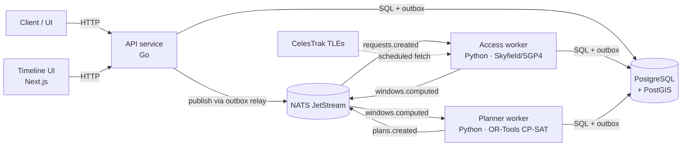
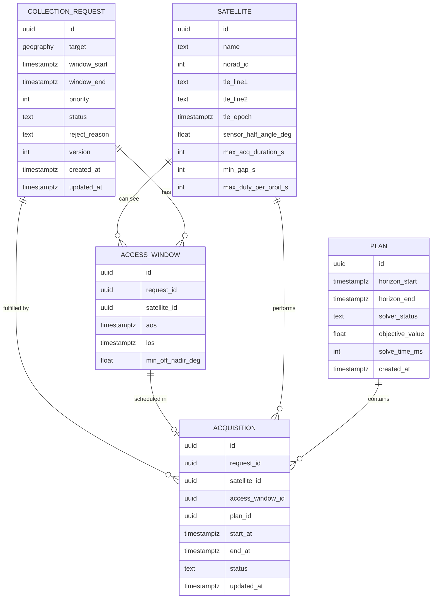
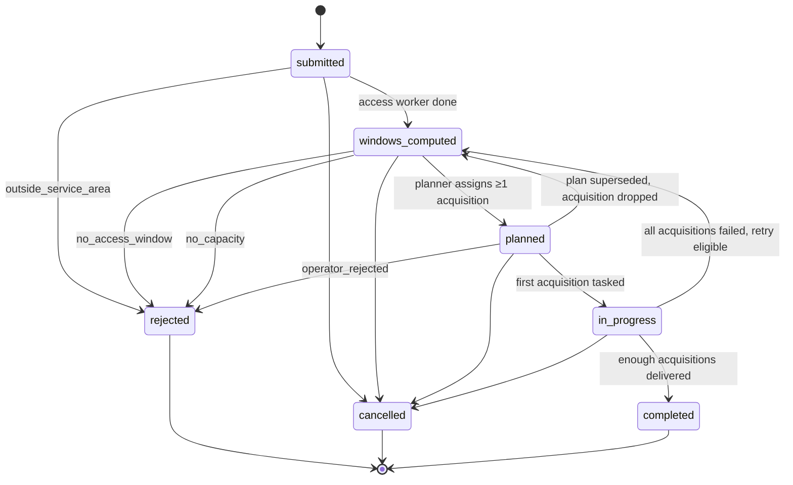
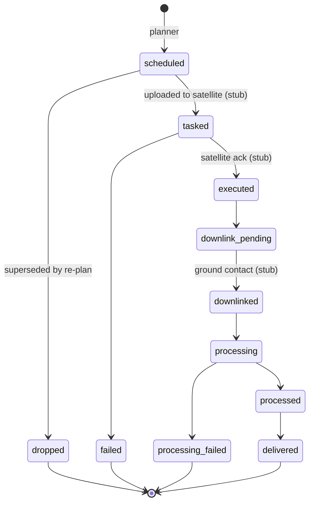

# Collection Tasking Planner

Takes collection requests over target areas, works out which satellites can see each target and when, and produces a conflict-free acquisition plan that respects satellite capacity and priority. Re-plans as new requests arrive.

A small, honest replica of the tasking-and-planning problem in a LEO constellation's ground segment, built as a cloud-native, event-driven system.

> **Status: v0 in progress.** The scope below is the v0 contract. Items are checked off as they land. See [Roadmap](#roadmap) for what is deliberately out of scope.

---

## Contents

- [The problem](#the-problem)
- [How it works](#how-it-works)
- [Architecture](#architecture)
- [Domain model](#domain-model)
- [Lifecycles](#lifecycles)
- [Events](#events)
- [API](#api)
- [Access window computation](#access-window-computation)
- [Planner](#planner)
- [Non-functional requirements](#non-functional-requirements)
- [v0 scope](#v0-scope)
- [Repository layout](#repository-layout)
- [Getting started](#getting-started)
- [Testing](#testing)
- [Design decisions](#design-decisions)
- [AI-assisted development](#ai-assisted-development)
- [Roadmap](#roadmap)

---

## The problem

A user wants data collected over an area of interest (a port, a border segment, a shipping lane) within a time window, with some urgency. A constellation of LEO satellites passes over different parts of the Earth on ~90-minute orbits, each seeing a target for only a few minutes per pass, and each with limited capacity per orbit. Many requests compete for the same passes.

The tasking system has to answer, continuously:

1. **Feasibility** — which satellites can cover this target, and during which time intervals?
2. **Planning** — given every open request and every feasible interval, which acquisitions should each satellite perform so that the most valuable set of requests is served without conflicts?
3. **Coordination** — hand the plan to the ground segment for upload to the satellites, and track each acquisition through execution.

This project implements (1) and (2) in depth and (3) as a stub with a real state model.

## How it works

```mermaid
flowchart LR
request submitted (API) --> access windows computed (orbit propagation) --> plan produced (CP-SAT solver) --> acquisitions scheduled (stub execution)
```

1. A client `POST`s a **collection request**: a GeoJSON polygon, a time window, a priority.
2. The **access worker** propagates each satellite's orbit from its TLE (SGP4) across the request window and finds the intervals where the satellite's footprint intersects the target polygon. These are **access windows**.
3. The **planner worker** takes all open requests and their access windows and solves a constraint problem: pick a set of acquisitions that maximises priority-weighted coverage, subject to no overlaps per satellite, minimum turnaround gaps, and per-orbit duty limits. The result is an immutable **plan** with one **acquisition** per served request.
4. Each stage is triggered by an event on NATS JetStream. Consumers are idempotent, so retries and redeliveries are safe.
5. A timeline view shows the plan per satellite; the API exposes every entity and why an unserved request was not planned.

## Architecture



| Component | Language / library | Responsibility |
|---|---|---|
| `api` | Go, chi, pgx | Request intake, read models, status rollup, outbox relay |
| `workers/access` | Python, Skyfield, SGP4, Shapely | TLE ingest, orbit propagation, footprint/target intersection |
| `workers/planner` | Python, OR-Tools CP-SAT | Constraint scheduling, plan snapshots, rejection reasons |
| `web` | TypeScript, Next.js | Per-satellite timeline of the current plan |
| Storage | PostgreSQL 16 + PostGIS | System of record for all entities; outbox and idempotency tables |
| Messaging | NATS JetStream | At-least-once event delivery between services |
| Deploy | Docker Compose (local), Helm + Terraform (Kubernetes) | One-command local stack; cluster deploy |

**Why Go and Python together.** The API is Go for the same reasons it is Go in most infrastructure teams: a small, fast binary with excellent concurrency and database tooling. The workers are Python because the orbital-mechanics and constraint-solving ecosystems (Skyfield, SGP4, OR-Tools) are mature there and have no equivalent in Go. The boundary between them is an event contract and a shared database schema, not shared code. See [ADR-0001](docs/adr/0001-polyglot-services.md).

## Domain model

The central modelling decision: **planning-time entities and execution-time entities have different lifecycles and different cardinality, so they are separate.** A request expresses intent; an acquisition is a concrete unit of work assigned to a satellite. One request can produce zero, one, or several acquisitions (retries, redundancy).



Supporting tables: `outbox` (events awaiting publication), `processed_events` (per-consumer idempotency ledger), `tle_snapshots` (raw TLE sets with fetch time, so any plan can be reproduced).

**Priority** is 1–5, where 1 is most urgent. It is mapped to an objective weight in the planner (see [Planner](#planner)).

**Target** is a GeoJSON `Polygon` in WGS84 (RFC 7946), stored as a PostGIS `geography` column. v0 accepts a single polygon; multipolygons and points-with-radius are on the roadmap.

## Lifecycles

### Collection request



- `windows_computed` with zero windows is a valid state; rejection with `no_access_window` follows from it. The distinction matters: "we looked and found nothing" is different from "we have not looked yet".
- `rejected` always carries a `reject_reason`: `outside_service_area`, `no_access_window`, `no_capacity`, `operator_rejected`.
- Request status is a **rollup** derived from its acquisitions and planner output. Services write acquisition state; the request state follows.

### Acquisition



Everything from `tasked` onward is **stubbed in v0**: the states and transitions are real and enforced, but there is no satellite link, ground-station contact model, or processing pipeline behind them. A development-only endpoint advances an acquisition manually so the full lifecycle can be exercised end to end.

## Events

All inter-service communication is through JetStream. Every event carries the same envelope:

```json
{
  "id": "0192f1c2-7e8b-7c3a-9d2e-1a2b3c4d5e6f",
  "type": "requests.created",
  "version": 1,
  "occurred_at": "2026-09-14T08:15:30.412Z",
  "producer": "api",
  "payload": { }
}
```

| Subject | Producer | Consumer | Payload |
|---|---|---|---|
| `requests.created` | api | access worker | `request_id`, `window_start`, `window_end` |
| `requests.cancelled` | api | planner | `request_id` |
| `windows.computed` | access worker | planner | `request_id`, `window_count` |
| `plans.created` | planner | api | `plan_id`, `horizon_start`, `horizon_end`, `acquisition_ids[]`, `unplanned[]` (`request_id`, `reason`) |
| `acquisitions.status_changed` | api / stub | api (rollup) | `acquisition_id`, `request_id`, `from`, `to` |
| `tle.refreshed` | access worker | planner | `snapshot_id`, `satellite_ids[]` |

Streams: `REQUESTS`, `WINDOWS`, `PLANS`, `ACQUISITIONS`, `TLE`. Consumers are durable, pull-based, explicit-ack, with a max-deliver limit and a dead-letter subject.

**Delivery contract.** Events are published through a transactional outbox: the producing service writes its state change and the outbox row in one transaction; a relay publishes from the outbox and marks rows published. Consumers record `(consumer_name, event_id)` in `processed_events` inside the same transaction as their side effects. Net effect: at-least-once delivery, exactly-once processing.

## API

Base path `/v1`. JSON in, JSON out. Errors follow RFC 9457 problem details.

| Method | Path | Purpose |
|---|---|---|
| `POST` | `/requests` | Submit a collection request |
| `GET` | `/requests` | List requests; filters: `status`, `from`, `to`, `priority`; cursor pagination |
| `GET` | `/requests/{id}` | Request with current status, reject reason, version |
| `POST` | `/requests/{id}/cancel` | Cancel; requires `If-Match: <version>` |
| `GET` | `/requests/{id}/windows` | Access windows found for this request |
| `GET` | `/requests/{id}/acquisitions` | Acquisitions and their states |
| `GET` | `/requests/{id}/explain` | Why the request is (or is not) planned |
| `GET` | `/plans/latest` | Current plan snapshot |
| `GET` | `/plans/{id}` | A specific plan snapshot |
| `GET` | `/timeline?from&to` | Acquisitions per satellite in a time range (feeds the UI) |
| `GET` | `/satellites` | Constellation and current TLE epochs |
| `POST` | `/dev/acquisitions/{id}/transition` | **Dev only.** Advance stubbed execution states |
| `GET` | `/healthz`, `/readyz` | Liveness / readiness |

Submit a request:

```http
POST /v1/requests
Content-Type: application/json

{
  "target": {
    "type": "Polygon",
    "coordinates": [[[-0.40,39.40],[-0.30,39.40],[-0.30,39.50],[-0.40,39.50],[-0.40,39.40]]]
  },
  "window_start": "2026-09-15T00:00:00Z",
  "window_end":   "2026-09-16T00:00:00Z",
  "priority": 2
}
```

```http
HTTP/1.1 201 Created
Location: /v1/requests/0192f1c2-…

{
  "id": "0192f1c2-…",
  "status": "submitted",
  "priority": 2,
  "version": 1,
  "created_at": "2026-09-14T08:15:30Z"
}
```

Explain an unplanned request:

```json
{
  "request_id": "0192f1c2-…",
  "status": "windows_computed",
  "planned": false,
  "windows_found": 3,
  "reason": "no_capacity",
  "detail": "All 3 windows conflict with higher-priority acquisitions",
  "conflicts": [
    { "window_id": "…", "satellite": "SAT-2", "blocked_by_request": "…", "blocked_by_priority": 1 }
  ]
}
```

Concurrency: mutating calls on a request require `If-Match` with the current `version`; a stale version returns `409 Conflict`.

## Access window computation

For each request and each satellite:

1. Load the latest TLE snapshot and propagate the orbit with SGP4 across `[window_start, window_end]` at a coarse step (10 s), computing the sub-satellite point on WGS84.
2. Model the sensor footprint as a circle on the ground centred on the sub-satellite point, with radius derived from altitude and `sensor_half_angle_deg`. This is a deliberate simplification of a real side-looking swath; see [ADR-0004](docs/adr/0004-footprint-model.md).
3. Test whether the footprint intersects the target polygon (Shapely, geodesic-aware buffer). Consecutive positive samples form a candidate window.
4. Refine window boundaries by bisection to 1 s resolution and record `aos`, `los`, and the minimum off-nadir angle to the target centroid.
5. Persist windows and publish `windows.computed`.

TLEs are fetched from CelesTrak on a schedule (default 6 h) and stored as snapshots. Tests run against a pinned snapshot committed to the repo, so results are deterministic.

## Planner

A CP-SAT model over all open requests and their access windows within a planning horizon (default 48 h).

**Decision variables.** For each access window *w*: a Boolean `x[w]` meaning "an acquisition is scheduled in this window", with an interval variable of fixed duration `min(los − aos, max_acq_duration)` starting at `aos`.

**Constraints.**
- At most one acquisition per request (v0; redundancy is on the roadmap).
- No two acquisitions on the same satellite overlap, including `min_gap_s` turnaround — modelled with `AddNoOverlap` over the satellite's optional intervals.
- Per-orbit duty limit: the sum of acquisition durations within any orbital period on a satellite ≤ `max_duty_per_orbit_s`.
- Committed acquisitions (already `tasked`) are fixed.

**Objective.** Maximise Σ `weight(priority) · x[w]`, with weights `{1: 16, 2: 8, 3: 4, 4: 2, 5: 1}` so that a single higher-priority request outweighs any number at the next level down. Ties are broken toward the earliest window.

**Runtime.** Solver time limit 10 s; the best solution found is used and `solver_status` records `OPTIMAL` or `FEASIBLE`. If the solver produces nothing within the limit, a greedy fallback (priority, then earliest window) runs so a plan always exists.

**Output.** An immutable `plan` row, one `acquisition` per selected window in `scheduled` state, and a list of unplanned requests each with a reason. Acquisitions from the previous plan that are not in the new one move to `dropped`; their requests fall back to `windows_computed`.

## Non-functional requirements

| Requirement | How it is met | How it is verified |
|---|---|---|
| No lost requests on worker crash | Outbox publishing; explicit ack after commit | Integration test kills the access worker mid-batch and asserts every request reaches `windows_computed` |
| Safe redelivery | Idempotent consumers keyed on event id | Test replays a `requests.created` event and asserts a single set of windows |
| Consistent state transitions | State machines enforced in one place per entity; illegal transitions rejected | Unit tests over the transition tables |
| Plans are auditable | Immutable plan snapshots; acquisitions reference their plan | `GET /plans/{id}` after re-plan returns the original |
| Bounded planner runtime | CP-SAT time limit + greedy fallback | Test with 500 synthetic requests completes under 15 s |
| Reproducible results | Pinned TLE snapshot; deterministic solver seed in tests | CI runs the end-to-end scenario and diffs the plan against a golden file |
| Observability | OpenTelemetry traces across API → NATS → workers; Prometheus metrics | Trace for a single request spans all three services |

Key metrics: `requests_by_status`, `windows_per_request`, `plan_solve_seconds`, `plan_served_ratio`, `outbox_lag_seconds`, `consumer_redeliveries_total`.

## v0 scope

**In scope**

- [ ] Request intake API with validation, versioning, cursor pagination
- [ ] Request and acquisition state machines with rollup
- [ ] TLE ingest from CelesTrak with snapshots; pinned fixture for tests
- [ ] Access window computation for a 6-satellite fixture constellation
- [ ] CP-SAT planner with no-overlap, turnaround gap, duty limit, priority objective
- [ ] Greedy fallback
- [ ] Re-planning on new or cancelled request, with committed acquisitions fixed
- [ ] `explain` endpoint with conflict attribution
- [ ] JetStream streams, durable consumers, outbox relay, idempotency ledger
- [ ] Stubbed execution lifecycle with dev transition endpoint
- [ ] Timeline UI (single page, per-satellite lanes)
- [ ] `docker compose up` brings up the whole stack with seed data
- [ ] End-to-end integration test and crash/replay tests
- [ ] OpenTelemetry + Prometheus + a Grafana dashboard
- [ ] Helm chart and Terraform for a Kubernetes deployment

**Explicitly out of scope for v0**

- Real satellite tasking uplink, ground-station contact modelling, onboard storage constraints
- Data processing and delivery
- Side-looking swath geometry, sensor modes, incidence-angle constraints
- Multi-acquisition redundancy per request
- Authentication and multi-tenancy (single trusted client)
- Globe visualisation

## Repository layout

```
.
├── api/                    Go API service
│   ├── cmd/api/
│   ├── internal/
│   │   ├── http/           handlers, problem details, pagination
│   │   ├── domain/         entities, state machines
│   │   ├── store/          pgx repositories, outbox
│   │   └── events/         JetStream publisher/consumer, relay
│   └── migrations/
├── workers/
│   ├── access/             TLE ingest, SGP4 propagation, window search
│   └── planner/            CP-SAT model, greedy fallback, plan writer
├── web/                    Next.js timeline UI
├── deploy/
│   ├── compose/            docker-compose.yml, seed data
│   ├── helm/
│   └── terraform/
├── fixtures/
│   ├── tle/                pinned TLE snapshot
│   └── scenarios/          request sets + golden plans
├── docs/
│   ├── adr/                architecture decision records
│   └── AI-LOG.md           log of AI-assisted development
├── CLAUDE.md               working conventions for AI coding agents
└── Makefile
```

## Getting started

Prerequisites: Docker and Docker Compose. Everything else runs in containers.

```bash
git clone https://github.com/<you>/tasking-planner
cd tasking-planner
make up          # postgres+postgis, nats, api, workers, web, seed constellation
make seed        # load the fixture scenario (12 requests over Iberia and the Baltic)
open http://localhost:3000
```

Submit a request and watch it move through the pipeline:

```bash
curl -s -X POST localhost:8080/v1/requests \
  -H 'Content-Type: application/json' \
  -d @fixtures/scenarios/valencia-port.json | jq .id

curl -s localhost:8080/v1/requests/<id> | jq .status        # submitted → windows_computed → planned
curl -s localhost:8080/v1/requests/<id>/explain | jq
curl -s localhost:8080/v1/timeline?from=…&to=… | jq
```

Useful targets:

```bash
make logs        # tail all services
make test        # unit + integration tests
make e2e         # full scenario against the running stack, diff vs golden plan
make down
```

## Testing

- **Unit**: state machines, footprint geometry against known geodesic cases, CP-SAT model on hand-built tiny instances with known optima.
- **Integration**: API + Postgres + NATS in containers; submit → windows → plan; replay and crash tests for delivery guarantees.
- **End-to-end**: pinned TLE snapshot + fixture scenario → golden plan. Any change to the planner that alters the golden plan must update it deliberately.
- **CI**: GitHub Actions runs all three on every push.

## Design decisions

Architecture decision records live in [`docs/adr`](docs/adr).

| ADR | Decision |
|---|---|
| [0001](docs/adr/0001-polyglot-services.md) | Go for the API, Python for orbit and solver workers |
| [0002](docs/adr/0002-request-vs-acquisition.md) | Separate planning-time and execution-time entities |
| [0003](docs/adr/0003-jetstream-outbox.md) | NATS JetStream with a transactional outbox and idempotent consumers |
| [0004](docs/adr/0004-footprint-model.md) | Nadir-centred circular footprint as the v0 sensor model |
| [0005](docs/adr/0005-cp-sat-planner.md) | CP-SAT over greedy or MILP, with a greedy fallback |
| [0006](docs/adr/0006-immutable-plans.md) | Plans as immutable snapshots; re-planning drops rather than mutates |

## AI-assisted development

This project is built AI-first. [`CLAUDE.md`](CLAUDE.md) holds the conventions an agent works under (spec-before-code, ADR-first for design changes, test expectations, what never to touch). [`docs/AI-LOG.md`](docs/AI-LOG.md) is a dated record of where AI tooling helped, where it produced something plausible but wrong, and how that was caught. The log is kept as a working engineering note rather than a marketing document.

## Roadmap

**v1 — ground segment coupling**
- Ground-station contact windows; onboard storage as a planning constraint (an acquisition is only feasible if a downlink contact exists before storage fills)
- Frozen planning horizon (committed acquisitions in the next *N* hours are never re-planned)
- Multi-acquisition redundancy per request
- Operator actions: manual reject, pin an acquisition to a satellite

**v2 — fidelity**
- Side-looking swath footprint, incidence-angle constraints, sensor modes
- Revisit metrics per target; planner runtime vs request count benchmarks
- CZML export and a globe view of ground tracks and footprints
- Authentication and per-tenant request isolation

## License

MIT
